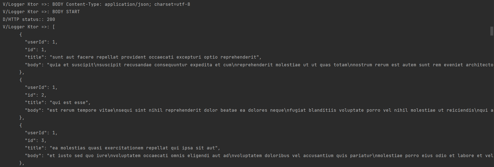
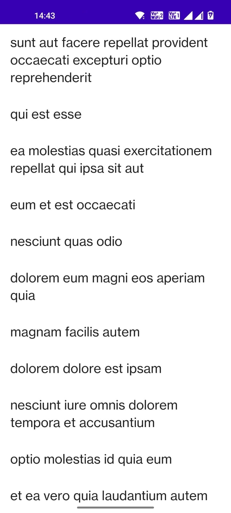

# Ktor Example

Ktor is an asynchronous open source framework developed with Kotlin by Jetbrains for creating microservices and web applications.
Ktor is multiplatform, can deploy Ktor applications anywhere, and not only as a server, but we can also consume microservices on Android, iOS, or JS with Ktor Client. Ktor Client allows you to make requests and handle responses, extend its functionality with features, such as authentication, JSON serialization, and so on.

## Demos

